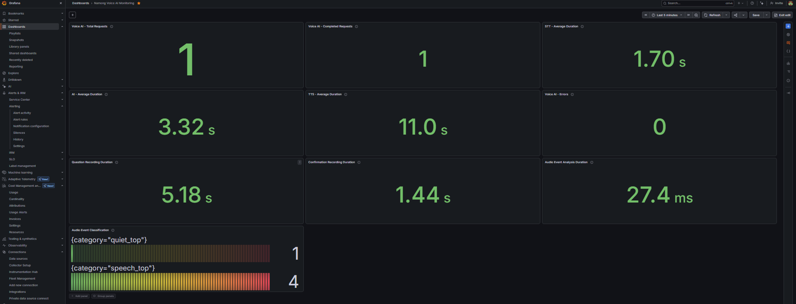

# Namong Voice AI Agent 🎙️

**로컬 한국어 음성 주문 상담원 | Voice AI · AI Agent · DevOps Monitoring**

마이크로 주문번호와 배송 상태를 질문하면, 로컬 음성 인식으로 주문번호를 추출하고 고객에게 음성으로 재확인한 뒤 기존 AI Agent를 통해 주문 정보를 조회하여 한국어 음성으로 답변하는 개인 프로젝트입니다. 실제 사용자 테스트에서 발견한 고정 녹음 대기 문제를 개선하기 위해 **Silero VAD**를 도입했고, **YAMNet**으로 녹음 구간별 음향 이벤트를 분석합니다. Prometheus와 Grafana Cloud를 이용해 처리 시간과 요청/완료/오류 지표를 모니터링합니다.

> **프로젝트 범위:** Windows 기반 로컬 프로토타입이며, 테스트 주문 데이터로 검증했습니다. 실제 고객 신원 인증, 전화망 연동, 음성 중 끼어들기(barge-in), 노이즈 제거 및 운영 환경의 성능 보장은 구현 범위에 포함되지 않습니다.

## Demo / Monitoring



대시보드는 로컬 Prometheus가 수집한 메트릭을 Grafana Cloud에서 시각화합니다. 스크린샷의 수치는 해당 테스트 실행 시점의 관측값이며, 일반적인 서비스 성능을 나타내지 않습니다.

## 핵심 기능

- **한국어 음성 입출력:** whisper.cpp 기반 Whisper STT, Piper 한국어 TTS.
- **주문번호 인식:** 아라비아 숫자와 한 자리씩 말한 한국어 숫자(예: `구 구 구 구`)를 주문번호로 정규화.
- **음성 확인 및 재시도:** AI가 주문번호를 읽어 주고 고객이 `네`/`아니요`로 응답. 번호 인식 실패 또는 부정 응답 시 최대 2회 확인하며, 확인되지 않은 주문은 조회하지 않음.
- **발화 시작·종료 감지:** Silero VAD(ONNX) 기반 자동 녹음 종료. 처음 상담 시작에는 Enter 입력이 필요함.
- **음향 이벤트 분석:** YAMNet(ONNX)을 이용해 녹음 오디오를 구간별로 분석하고 음성 우세/정적 우세/기타 이벤트 우세로 집계. **분류만 수행하며 소음 제거·음원 분리는 하지 않음.**
- **기존 AI Agent 연동:** `agent.py`의 `process_question()`으로 테스트 주문 조회 후 한국어 음성 응답.
- **관측성:** Prometheus 메트릭(기본 로컬 `127.0.0.1:8001/metrics`)과 Grafana Cloud 대시보드.

## 처리 흐름

```text
고객 Enter → 마이크 입력 → Silero VAD 발화 감지·녹음 자동 종료
             ├─ YAMNet 구간별 음향 이벤트 분석 (진단용)
             └─ Whisper STT → 주문번호 추출
                              ↓
                    Piper 주문번호 음성 재확인
                              ↓
                   고객의 네/아니요 음성 인식
                     ├─ 확인: AI Agent 주문 조회 → Piper 음성 답변
                     └─ 부정/추출 실패: 재시도 (최대 2회)

처리 단계의 관측값 → Prometheus → Grafana Cloud
```

## 기술 스택

| 영역 | 사용 기술 |
| --- | --- |
| 언어/환경 | Python 3.14, Windows, PowerShell |
| 음성 인식/합성 | whisper.cpp + Whisper base, Piper 한국어 음성 모델 |
| 음성 활동 감지 | Silero VAD + ONNX Runtime |
| 음향 이벤트 분류 | YAMNet ONNX + 클래스 목록 CSV |
| 상담 로직 | 기존 Python AI Agent (`agent.py` / `process_question`), 로컬 LLM 및 주문 조회 로직 |
| 모니터링 | prometheus-client, Prometheus, Grafana Cloud |

## 디렉터리 구성

```text
voice-ai-agent/
├── README.md
├── .gitignore
├── voice_agent_vad_noise.py      # 최신 VAD·음향 분류 통합 버전
├── agent.py                      # 본인의 기존 AI Agent 코드: 별도로 추가
├── docs/
│   └── grafana_voice_monitoring.png
├── stt/                          # 로컬에만 설치 (Git 제외)
│   ├── ggml-base.bin
│   ├── ko_KR-kss-medium.onnx
│   ├── **/whisper-cli.exe
│   └── audio_models/
│       ├── silero_vad.onnx
│       ├── yamnet.onnx
│       └── yamnet_class_map.csv
└── .venv-tts/                    # 로컬 Piper 실행 환경 (Git 제외)
```

이 저장소의 통합 소스는 **독립 실행형 패키지가 아닙니다.** 기존 `agent.py`와 그 모듈이 필요로 하는 주문 데이터/설정/로컬 LLM 서버를 사용합니다. 해당 코드·설정은 공개 가능한 부분만 별도로 검토해 추가해야 합니다. 개인 토큰, 실제 고객 정보, 사내 자료는 포함하지 마세요.

## 로컬 실행 (Windows)

아래 내용은 **기존 AI Agent가 이미 로컬에서 실행 가능한 환경**을 전제로 한 설정입니다.

1. Python 환경에 필요한 패키지를 설치합니다.

   ```powershell
   python -m pip install numpy sounddevice onnxruntime prometheus-client
   ```

   `agent.py`에 필요한 의존성은 해당 파일의 실제 import 및 기존 로컬 환경에 맞춰 별도로 설치합니다.

2. whisper.cpp의 `whisper-cli.exe`, Whisper 모델, Piper 모델, Silero/YAMNet ONNX 모델과 CSV를 위 경로에 준비합니다. `PIPER_PYTHON` 경로(`.venv-tts/Scripts/python.exe`)도 실제 설치 위치와 일치해야 합니다. 모델 및 바이너리는 해당 배포처의 이용 조건과 라이선스를 확인해 직접 다운로드합니다.

3. 기존 음성 상담원과 **동시에 실행하지 않은 상태에서** 다음 명령어로 새 버전을 실행합니다.

   ```powershell
   python -m py_compile voice_agent_vad_noise.py
   python voice_agent_vad_noise.py
   ```

4. Enter를 누르고 테스트 주문번호를 말합니다. AI가 번호를 음성으로 확인하면 `네` 또는 `아니요`로 답합니다. 메트릭은 `http://127.0.0.1:8001/metrics`에서 확인할 수 있습니다.

> 마이크·스피커 장치, 모델 파일 형식/버전, 기존 AI Agent 의존성에 따라 추가 설정이 필요할 수 있습니다. 실사용 전 음성 인식과 주문 조회를 본인 환경에서 직접 테스트하세요.

## 주요 Prometheus 메트릭

| 이름 | 의미 |
| --- | --- |
| `voice_agent_requests_total` | 시작된 음성 상담 횟수(현재 프로세스 누적) |
| `voice_agent_completed_total` | 최종 음성 답변까지 완료한 횟수 |
| `voice_agent_errors_total` | 예외로 기록된 오류 횟수. 확인 실패·취소는 별도 오류로 기록되지 않을 수 있음 |
| `voice_agent_stt_duration_seconds` | STT 호출 1회당 처리 시간 히스토그램 |
| `voice_agent_ai_duration_seconds` | 주문 조회 처리 시간 히스토그램 |
| `voice_agent_tts_duration_seconds` | **최종 답변** TTS 생성+재생 시간 (중간 안내 제외) |
| `voice_agent_total_duration_seconds` | 정상 완료된 상담의 전체 처리 시간 |
| `voice_agent_record_duration_seconds{step=...}` | 질문/확인/재시도 단계별 녹음 길이 |
| `voice_agent_noise_analysis_duration_seconds` | YAMNet 진단용 분석 소요 시간 |
| `voice_agent_audio_event_windows_total{category=...}` | 모델의 우세 이벤트 범주별 누적 분석 구간 수 (실제 소음 발생 건수가 아님) |

메트릭 카운터는 프로세스를 재시작하면 초기화됩니다. Grafana Cloud로 수집되기까지 시간이 걸릴 수 있으며, 로컬 메트릭과 Cloud 값은 수집 시점에 따라 달라질 수 있습니다.

## 테스트 기록 (2026-09-25)

동일한 **테스트 주문번호 1234**로 진행한 수동 기능 검증입니다. 조용한 환경 1회와 음악 재생 환경 2회의 결과를 비교합니다. 이전에 실행한 별도의 성공 기록은 이 비교의 표본 수에 포함하지 않았습니다.

| 환경/상담 | 최초 질문 녹음 | 확인 음성 녹음 | 주문번호 인식·확인 | 전체 처리 시간 | 결과 |
| --- | ---: | ---: | --- | ---: | --- |
| 조용한 환경 1회 | 5.18초 | 1.44초 | 1234, `네` | 34.74초 | 정상 완료 |
| 음악 환경 1회 | 5.02초 | 1.54초 | 1234, 확인 응답 `-네.`로 전사 | 기록 없음 | 확인 불명확으로 조회 중단 |
| 음악 환경 2회 | 4.06초 | 1.57초 (재시도 질문 4.29초 별도) | 최초 질문의 번호 추출 실패 → 재질문에서 1234 인식 및 `네` 확인 | 43.43초 | 재시도 후 정상 완료 |

**관찰:** 조용한 환경의 확인 응답 녹음은 1.44초로, 기존 4초 고정 녹음보다 녹음 길이가 2.56초 짧았습니다. 음악 환경의 일부 분석 구간에서 YAMNet이 `Music`을 우세 이벤트로 분류했으며, 두 음악 환경 테스트 중 한 건은 확인 응답 전사 문제로 조회를 중단하고 다른 한 건은 주문번호 재시도 후 완료했습니다. 이 결과만으로 음악이 오류의 직접 원인이라고 단정할 수는 없습니다.

**평가 한계:** 환경별 표본 수가 매우 작고 동일 음원의 반복·통제 실험이 아니므로, 일반적인 STT 정확도·음향 분류 정확도·성능 개선률로 해석할 수 없습니다. YAMNet 점수는 모델의 추정값이며 잡음 제거·화자 분리 또는 고객 인증 성능을 의미하지 않습니다.

## 개발 중 발견한 문제와 대응

- **고정 녹음 대기로 인한 사용성 문제:** 사용자가 답변을 빨리 말하는 실사용 테스트 피드백을 반영해 Silero VAD 기반 자동 녹음 종료 방식 도입.
- **한글 숫자 및 오인식:** `구구구구`, `1, 2, 3, 4` 등 한 자리 숫자 표현을 정규화하고, 확인되지 않은 번호는 조회하지 않도록 음성 확인·재시도 흐름 구현.
- **짧은 확인 응답:** 음악 재생 중 `네`가 `-네.`로 전사되어 확인이 실패한 사례를 확인. 무조건 긍정 처리하지 않고 조회를 중단함. 향후 문장부호 정규화의 테스트 범위 확장 필요.
- **모니터링 카운터 불일치:** 음성 상담원 중복 프로세스 실행 가능성을 확인하고 단일 프로세스 테스트로 정상 갱신 검증.

## 제한 사항 및 향후 개선

- AI 안내 **도중** 고객이 답하는 음성을 듣는 barge-in/에코 제거는 아직 미구현.
- 주문번호 음성 확인은 실제 고객 본인 인증을 대체하지 않음.
- 주문번호 확인 안내의 TTS 시간과 최종 답변 TTS 시간을 분리하여 운영 지표를 정교화할 수 있음.
- 다수 화자/다양한 마이크/소음 종류에 대한 반복·통제 평가, 짧은 응답 전처리 및 소음 억제 모델은 추후 과제.

## 공개 전 확인

실제 고객·회사 데이터, API 키, Grafana 토큰, `.env`, 개인 음성 원본, 가상환경 및 모델 바이너리가 Git에 포함되지 않았는지 반드시 확인하세요. 공개할 사진·로그에도 개인정보/토큰이 보이지 않는지 검토하세요.
